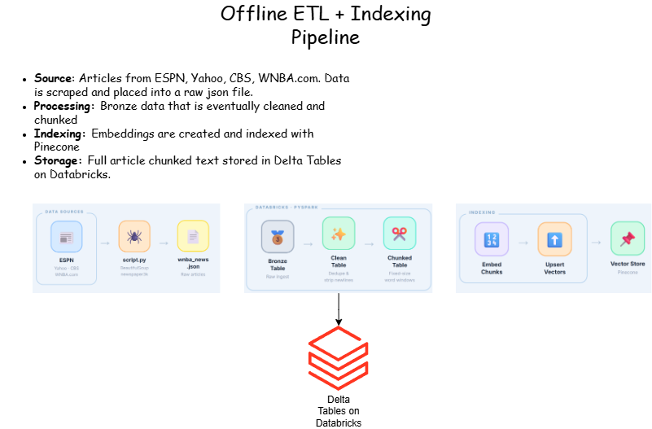

# WNBA Chat App

A backend chat API for answering questions about WNBA news using a Retrieval-Augmented Generation (RAG) approach. Users submit natural-language questions and receive answers grounded in a curated dataset of WNBA news articles.

---

## What This Project Does

The application exposes a REST API that accepts a question about WNBA news and returns a contextually accurate answer generated by an LLM. Rather than relying solely on a model's training data, every answer is anchored to relevant passages retrieved from a pre-indexed corpus of WNBA news articles, reducing hallucinations and keeping responses up to date with the ingested dataset.

---

## How It Works

### Request Flow

1. **Question received** — A client sends a `POST /api/chat` request with a `message` field containing the user's question.
2. **Embed the query** — The question is converted into a dense vector using the OpenAI `text-embedding-ada-002` model via `EmbeddingService`.
3. **Vector search (Pinecone)** — The embedding is used to query a Pinecone serverless index (`wnba-chat-pinecone-rag`). The top-5 nearest-neighbor chunk IDs are returned via `VectorStoreService`.
4. **Fetch chunk text (Databricks)** — The chunk IDs are used to retrieve the corresponding raw text passages from a Delta table stored in Databricks via `ContentStoreService` and the `databricks-sql-connector`.
5. **Prompt the LLM (OpenAI)** — The retrieved passages are assembled into a context block and injected into a prompt alongside the original question. The prompt is sent to GPT-4-turbo through `ModelService`.
6. **Answer returned** — The model's response is returned to the client as a JSON object: `{ "response": "..." }`.

### API Routing

The Django project routes all chat traffic through Django REST Framework:

| Method | Endpoint   | View        | Description                     |
|--------|------------|-------------|---------------------------------|
| POST   | `/api/chat` | `ChatView`  | Submit a question, receive an answer |

`wnba_chat_api/urls.py` includes the `chatapi` URL configuration under the `/api/` prefix. `ChatView` deserializes the request via `ChatSerializer`, delegates to `SimpleRagService`, and returns the result or an appropriate HTTP error code.

---

## Offline ETL + Indexing Pipeline

The diagram below shows the end-to-end offline pipeline that prepares data before the API serves any traffic.

---

## What's Happening in `/data`

The `data/` directory contains the offline ETL and indexing pipeline used to populate the vector store and Delta tables before the API serves any traffic. None of these scripts are invoked at request time.

| File | Purpose |
|------|---------|
| `data/wnba_news.json` | Raw dataset of WNBA news articles scraped from ESPN, Yahoo Sports, CBS Sports, and WNBA.com. Each record contains `source`, `title`, `url`, `date`, and `text` fields. |
| `data/data_prep.py` | Databricks notebook (PySpark). Reads `wnba_news.json`, cleans the data (drops empty rows, strips newlines), chunks article text into fixed-size word windows, and writes the results to Delta tables (`news_articles_bronze`, `news_articles_clean`, `news_articles_chunked`) in the `frantzpaul_tech.wnba_chat` catalog. |
| `data/pinecone_vector_creation.py` | Databricks notebook. Reads the `news_articles_chunked` Delta table, generates embeddings for each chunk in batches using the OpenAI `text-embedding-ada-002` model, and upserts the resulting vectors (with metadata: title, source, URL, date) into the Pinecone index. |
| `data/script.py` | Web-scraping utility that collects WNBA news articles from the four supported sources using `requests`, `BeautifulSoup`, and `newspaper3k`, and serializes them to `wnba_news.json`. |

---

## Technologies Used

| Technology | Role |
|------------|------|
| Python | Primary application language |
| Django | Web framework and project structure |
| Django REST Framework | API view routing and request serialization |
| django-cors-headers | Cross-Origin Resource Sharing (CORS) middleware |
| OpenAI API | Query embeddings (`text-embedding-ada-002`) and answer generation (GPT-4-turbo) |
| Pinecone | Serverless vector database for similarity search |
| Databricks / Delta Lake | Cloud data platform for ETL, chunking, and serving chunk text at query time |
